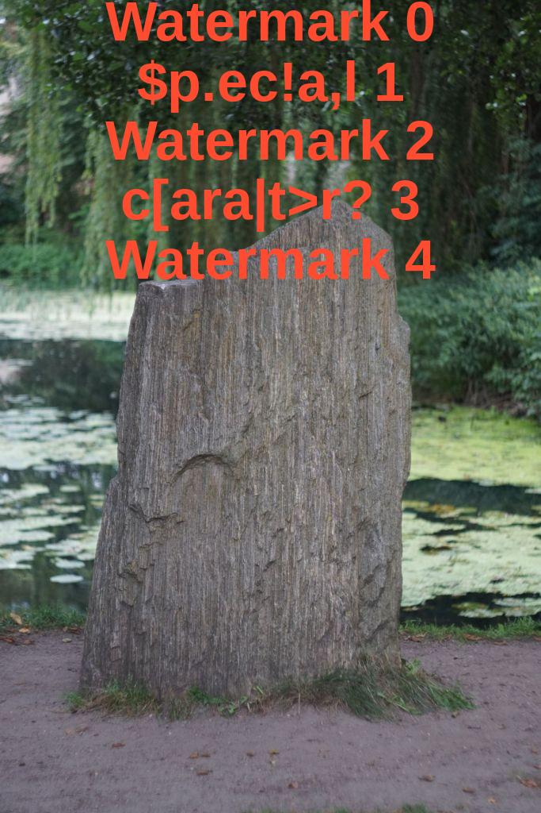
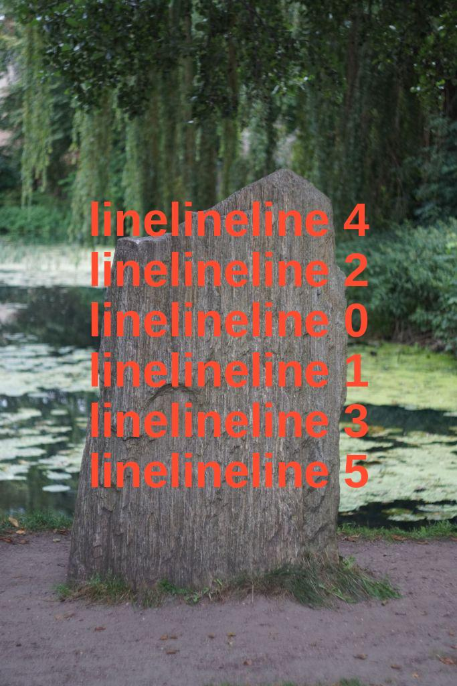
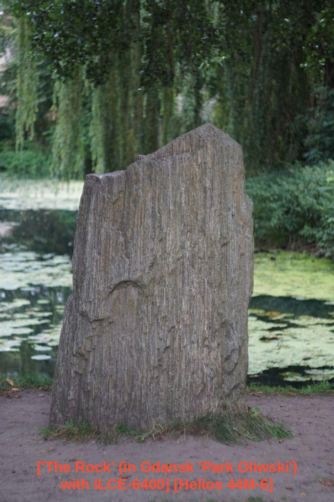

# This repository is synced
## Metadata
- Name: 'a-mark'.
- Author: a-matthew/Mateusz A.
- Purpose: Adding watermarks to images (incl. batch mode by default).
- Format: CLI (planned UI/Flatpak).
- License: 
  - [Project](LICENSE.txt)
  - ~~[QT](https://doc.qt.io/qtforpython-6/licenses.html)/[details from QT](https://www.qt.io/licensing/open-source-lgpl-obligations)~~ (if chosen)

## Setup
### Dependencies:
  - Version: __Python 3.14__
  - Manager: __venv__
    - https://docs.python.org/3/library/venv.html
  - Formatter: __Black__
    - https://pypi.org/project/black/
### Installation:
  1. `python3.14 -m venv {path}/a-mark/venv-3.14`
  2. `cd {path}/a-mark`
  3. `source venv-3.14/bin/activate`
  4. `pip install --upgrade pip`
  5. `pip install -r requirements.txt`
  6. double check with `which python` (Linux)
### Usage:
  - `a-mark/main.py`
    - configured using 'config.ini' file, or used via CLI arguments

## Example
### Watermark on top of the image

### Watermark in the center of the image ('interwoven' pattern)

### Watermark at the bottom of the image
